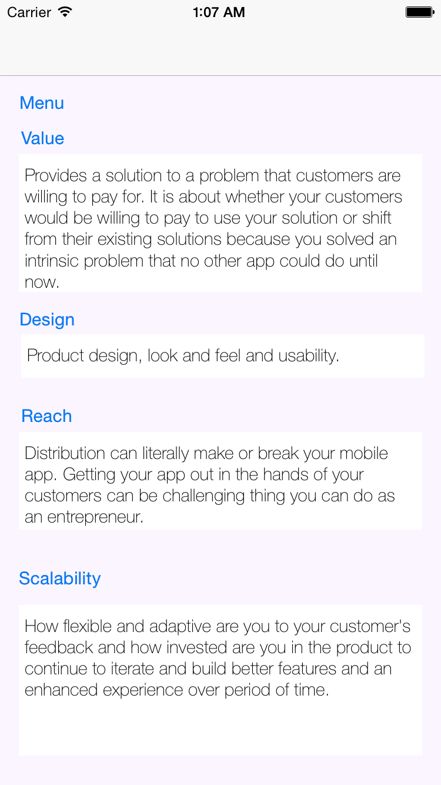

IRSlideMenuController (objc)

-----

* in early stage of development, support left menu only.
* recreating stuff like slide menu 
* inspired from SlideMenuController.swift (now converting to obj-c) and JASidePanelController

-----

developed by Hijazi at iReka Soft (www.irekasoft.com)